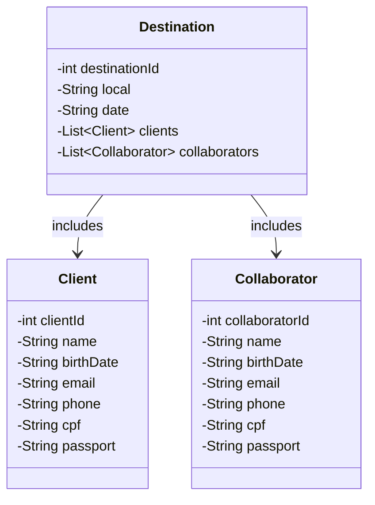

```mermaid
classDiagram
    class Client {
        -int clientId
        -String name
        -String birthDate
        -String email
        -String phone
        -String cpf
        -String passport
    }

    class Destination {
        -int destinationId
        -String local
        -String date
        -List~Client~ clients
        -List~Collaborator~ collaborators
    }

    class Collaborator {
        -int collaboratorId
        -String name
        -String birthDate
        -String email
        -String phone
        -String cpf
        -String passport
    }

    Destination --> Client : includes
    Destination --> Collaborator : includes

```

https://destino-api-production.up.railway.app/

https://destino-api-production.up.railway.app/swagger-ui/index.html
